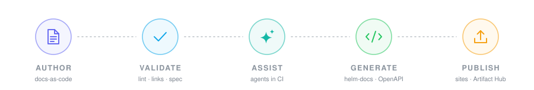
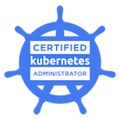

  

<h1 align="center">Aditya Raj</h1>

  <strong>Technical Writer</strong> · <strong>Documentation Engineer</strong> · <strong>DevOps</strong>

  
  
  
  

I treat documentation as part of the product. That means shipping docs the same way we ship
code - versioned in the repo, validated in CI, and published automatically - so that developers
can adopt, integrate, and operate software without guesswork.

## 🧭 At a glance

|  |  |
| :-- | :-- |
| 🎯 **Focus** | Developer Experience (DX) through documentation |
| 📚 **Day to day** | Owning documentation for enterprise software, end to end |
| ⚙️ **Automation** | Docs-as-code CI/CD - validate, generate, and publish on every merge |
| ☸️ **Infrastructure** | Kubernetes, OpenShift, Helm, AWS / Azure / GCP |
| 🎥 **Content** | Two YouTube channels - deployment walkthroughs, and DevOps / AI tutorials |

## 📚 Documentation engineering

I own documentation for enterprise software from information architecture through release -
the full lifecycle, not just the writing.

- **Doc set architecture** - scalable, versioned documentation with **Docusaurus** and **MkDocs**.
- **API references** - high-fidelity specs with **OpenAPI (Swagger)**, rendered via **Redoc** and **Scalar**.
- **Release documentation** - release notes, upgrade paths, and migration guides that survive contact with real customers.
- **Docs-as-code** - docs live beside the source, move through pull requests, and get reviewed like code.

### A merge, end to end

What actually happens between a developer opening a pull request and a customer reading the page:

| | Stage | What happens |
| :--: | :-- | :-- |
|  | **Author** | A change lands as Markdown/MDX beside the source it documents, and goes through review like any other pull request. |
|  | **Validate** | CI checks links, style rules, and drift against the API spec - contract tests with Schemathesis, mocked examples with Prism. |
|  | **Assist** | Agents draft updates from the code diff, flag pages the change made stale, and review the wording against the style guide. |
|  | **Generate** | Reference content is regenerated, never hand-copied - helm-docs for chart values, OpenAPI for endpoints. |
|  | **Publish** | On merge, the site builds and deploys, and chart docs ship to Artifact Hub. |

The point is simple: if documentation can go out of date silently, it will. This pipeline makes it fail loudly instead.

## ☸️ Cloud, Kubernetes & Helm

- **Deployment documentation** for **AWS**, **Azure**, and **GCP** - install, configure, scale, troubleshoot.
- **Cluster platforms** - deployment and operations guides for **Kubernetes** and **OpenShift**.
- **Helm** - chart documentation with values references generated by **helm-docs** and published to **Artifact Hub**.
- **Infrastructure as code** - **Terraform** for reproducible environments the docs can actually be tested against.
- **Automation** - GitHub Actions, Jenkins, Azure DevOps, and Bash to remove the manual steps between a merge and a published page.

## 🎓 Certification

  

  <strong>Certified Kubernetes Administrator (CKA)</strong> 
  Cloud Native Computing Foundation · Issued August 2026 · Certificate ID <code>LF-wuxaw08654</code> 
  <a href="https://www.credly.com/badges/ecbcdd60-3860-4315-ab52-29bc04739940/public_url"><strong>Verify on Credly →</strong></a> ·
  <a href="assets/cka-certificate.png">View certificate</a>

## 🎥 Video & developer education

Some things are faster to show than to describe. Alongside written docs I record walkthroughs and
tutorials, so teams can watch the happy path once before running it themselves. I run two channels:

- **[@memestagestartup](https://www.youtube.com/@memestagestartup)** - deployment walkthroughs:
  cluster deployments, Helm releases, and DevOps workflows, start to finish.
- **[@atechyap](https://www.youtube.com/@atechyap/videos)** - tutorials on DevOps, AI, and recent
  tech: the tooling as it lands, explained hands-on.

Recorded, edited, and published end to end, then measured - so the next video answers the question
the last one left open.

  
  &nbsp;&nbsp;&nbsp;&nbsp;&nbsp;
  
  &nbsp;&nbsp;&nbsp;&nbsp;&nbsp;
  

## 🧰 Toolbox

  
  &nbsp;&nbsp;&nbsp;&nbsp;
  
  &nbsp;&nbsp;&nbsp;&nbsp;
  
  &nbsp;&nbsp;&nbsp;&nbsp;
  
  &nbsp;&nbsp;&nbsp;&nbsp;
  
  &nbsp;&nbsp;&nbsp;&nbsp;
  
  &nbsp;&nbsp;&nbsp;&nbsp;
  

  
  &nbsp;&nbsp;&nbsp;&nbsp;
  
  &nbsp;&nbsp;&nbsp;&nbsp;
  
  &nbsp;&nbsp;&nbsp;&nbsp;
  
  &nbsp;&nbsp;&nbsp;&nbsp;
  
  &nbsp;&nbsp;&nbsp;&nbsp;
  
  &nbsp;&nbsp;&nbsp;&nbsp;
  

| Area | Tools |
| :-- | :-- |
| **Docs & sites** | Docusaurus, MkDocs, Markdown / MDX |
| **API docs** | OpenAPI (Swagger), Redoc, Scalar, Postman, Schemathesis, Prism |
| **Kubernetes** | Kubernetes, OpenShift, Helm, helm-docs, Artifact Hub, Docker |
| **Cloud & IaC** | AWS, Azure, GCP, Terraform |
| **CI/CD** | GitHub Actions, Jenkins, Azure DevOps, Git, Bash |
| **AI in the pipeline** | Claude, ChatGPT - agents that review, not just generate |
| **Testing** | Playwright, Schemathesis, link and style checks |
| **Video** | DaVinci Resolve, YouTube, Google Analytics |
| **Languages** | JavaScript, TypeScript, Bash, YAML |
| **Editor** | Neovim - custom LSP and YAML workflow |

## 🏗 Currently

- Going deeper into **Kubernetes internals** and **AWS Solutions Architecture**.
- Building OpenAPI documentation portals and CLI workflow tutorials.
- Expanding the use of agents in documentation pipelines - reviewing, not just generating.

## 🔗 Connect

- **YouTube** - [@memestagestartup](https://www.youtube.com/@memestagestartup) (deployment walkthroughs) · [@atechyap](https://www.youtube.com/@atechyap/videos) (DevOps / AI tutorials)
- **GitHub** - [@memestageceo](https://github.com/memestageceo)
- **Credly** - [CKA verification](https://www.credly.com/badges/ecbcdd60-3860-4315-ab52-29bc04739940/public_url)
- **Work** - pinned repositories below cover the featured documentation-engineering projects.
